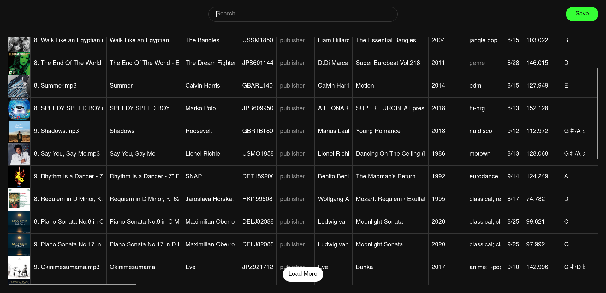

# Music Metadata Tagger Backend

Note: consider using [Metadata Remote](https://github.com/wow-signal-dev/metadata-remote) rather than this for reliability.

Flask-based WebUI to edit music collection metadata.



## Installation
Create a file containing this:
```yaml
services:
    tagger:
        image: ghcr.io/ungaul/tagger:latest
        container_name: tagger
        ports:
            - "5013:5013"
        restart: unless-stopped
        volumes:
            - $HOME/Music:/app/musics
            - ./covers:/app/covers
            - ./data:/app/data
            - ./migrations:/app/migrations
        environment:
            DB_USERNAME: admin
            DB_PASSWORD: changeme
            SECRET_KEY: aReallySecretKey
        mem_limit: 512m
```
Save as `docker-compose.yml`, then from the contaning folder:
```bash
docker compose up -d
```
Place your musics in the binded folder to make them appear in the WebUI.

## API Usage

|Purpose|Endpoint|Parameters | Example |
|--------|---------|--------|---------------|
| List music files with metadata| `/api/music`               | `offset` (optional, integer, for pagination)<br>`q` (optional, search query)<br>`sort_by` (optional, e.g. title, artist)<br>`sort_order` (optional, asc or desc) | http://localhost:5013/api/music?offset=0&q=beatles&sort_by=artist&sort_order=asc |
| Get metadata for a music file | `/api/music/<filename>`| -| http://localhost:5013/api/music/1.%20All%20I%20Need.mp3 |
| Update metadata & rename file| `/api/music/<filename>` (POST) | JSON body with metadata fields;<br>optional key `new_filename` to rename file | - |
| Delete a music file           | `/api/music/delete` (POST) | JSON body with key `filename` | -

## To Do

- Check full support for non-mp3 files.
- Sorting when clicking on a header.
- Check that sorting options accept every tag.
- Support/respect subfolder structure
